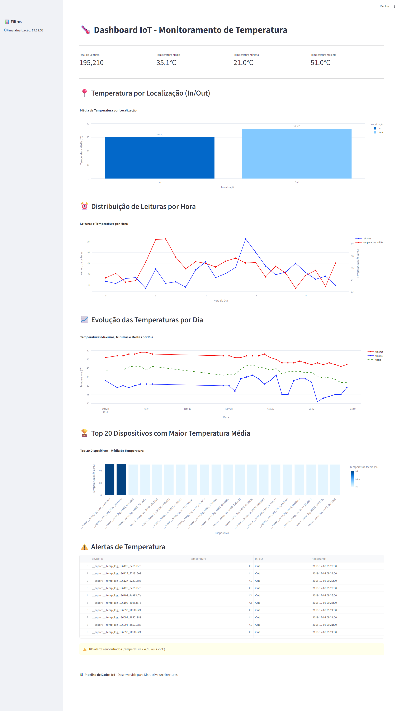
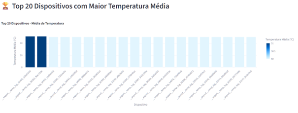
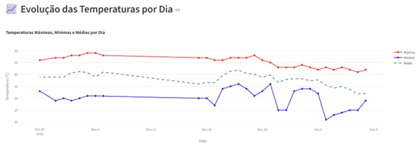
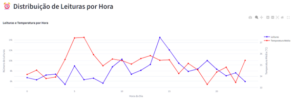

# 🌡️ Pipeline de Dados IoT - Monitoramento de Temperatura


## 📋 Sobre o Projeto

Este projeto implementa um **pipeline completo de dados para IoT** (Internet das Coisas), processando leituras de temperatura de sensores e disponibilizando um dashboard interativo para monitoramento em tempo real.

### 🎯 Objetivos
- Processar grandes volumes de dados de sensores IoT.
- Armazenar dados de forma eficiente em PostgreSQL.
- Criar views SQL para análises rápidas
- Disponibilizar dashboard interativo com Streamlit.
- Garantir reprodutibilidade via Docker

---

## 📊 Dashboard - Capturas de Tela

Aqui estão as visualizações do sistema. 
*(Nota: Se as imagens não carregarem imediatamente, por favor atualize a página com Ctrl+F5)*

### 1. Visão Geral do Dashboard


### 2. Análise de Dispositivos Críticos


### 3. Evolução Temporal das Temperaturas


### 4. Padrão de Temperatura por Hora


---

## 📁 Estrutura do Projeto

```text
Pipeline de Dados IoT/
├── src/                  # Código fonte
├── dashboards/           # Streamlit
├── sql/                  # Scripts SQL
├── docs/                 # Documentação
│   └── images/           # Imagens
└── README.md             # Este arquivo

🚀 Instalação e Execução
1. Clone e Ambiente
Bash
git clone [https://github.com/EvanildoLeal/pipeline-iot.git](https://github.com/EvanildoLeal/pipeline-iot.git)
cd pipeline-iot
python -m venv .venv
source .venv/bin/activate  # Linux/Mac ou .venv\Scripts\activate no Windows
pip install -r requirements.txt
2. Banco de Dados e Ingestão
Bash
docker-compose up -d
python src/ingestion_adapted.py
🗄️ Views SQL Implementadas
SQL
CREATE VIEW avg_temp_por_dispositivo AS
SELECT device_id, ROUND(AVG(temperature)::numeric, 2) as avg_temp
FROM temperature_readings
GROUP BY device_id
ORDER BY avg_temp DESC;
💡 Insights dos Dados
Temperaturas elevadas: Média de 35,1°C indica necessidade de refrigeração.

Picos temporais: Maiores temperaturas entre 14h-16h.

📝 Licença
Este projeto é de uso acadêmico para a disciplina Disruptive Architectures IOT.

👨‍💻 Autor
Evanildo de Sousa Leal Instituição: UNIFECAF
